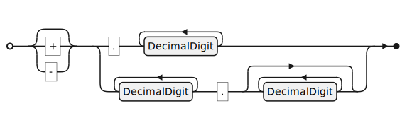

<ul class="noprint">
  <li>7.2 Lexical conventions
   <ul>
   <li><a href="#H7.2.2">7.2.2 Representation</a>
   </li>
   </ul>
  </li>
  <li>7.3 Objects
   <ul>
    <li><a href="#H7.3.3">7.3.3 Numeric objects</a>
    </li>
    <li>7.3.4 String objects
     <ul>
      <li><a href="#H7.3.4.2">7.3.4.2 Literal strings</a>
      </li>
     </ul>
    </li>
    <li><a href="#H7.3.7">7.3.7 Dictionary objects</a>
    </li>
    <li>7.3.8 Stream objects
     <ul>
      <li><a href="#H7.3.8.2">7.3.8.2 Stream extent</a>
      </li>
     </ul>
    </li>
    <li><a href="#H7.3.10">7.3.10 Indirect objects</a>
    </li>
   </ul>
  </li>
  <li>7.4 Filters
   <ul>
    <li><a href="#H7.4.1">7.4.1 General</a>
    </li>
    <li><a href="#H7.4.3">7.4.3 ASCII85Decode filter</a>
    </li>
    <li>7.4.4 LZWDecode and FlateDecode filters
     <ul>
      <li><a href="#H7.4.4.3">7.4.4.3 LZWDecode and FlateDecode parameters</a>
      </li>
     </ul>
    </li>
    <li><a href="#H7.4.9">7.4.9 JPXDecode filter</a>
    </li>
   </ul>
  </li>
  <li><a href="#H7.5">7.5 File structure</a>
   <ul>
    <li><a href="#H7.5.2">7.5.2 File header</a>
    </li>
    <li><a href="#H7.5.4">7.5.4 Cross reference table</a>
    </li>
    <li><a href="#H7.5.5">7.5.5 File trailer</a>
    </li>
    <li><a href="#H7.5.6">7.5.6 Incremental updates</a>
    </li>
    <li><a href="#H7.5.7">7.5.7 Object streams</a>
    </li>
    <li>7.5.8 Cross-reference streams
     <ul>
      <li><a href="#H7.5.8.2">7.5.8.2 Cross-reference stream dictionary</a>
      </li>
      <li><a href="#H7.5.8.4">7.5.8.4 Compatibility with applications that do not support compressed reference streams</a>
      </li>
     </ul>
    </li>
   </ul>
  </li>
  <li>7.6 Encryption
   <ul>
    <li><a href="#H7.6.2">7.6.2 Application of encryption</a>
    </li>
    <li><a href="#H7.6.3">7.6.3 General encryption algorithm</a>
     <ul>
      <li><a href="#H7.6.3.1">7.6.3.1 General</a>
      </li>
     </ul>
    </li>
    <li>7.6.4 Standard security handler
     <ul>
      <li><a href="#H7.6.4.1">7.6.4.1 General</a>
       <ul>
        <li><a href="#H7.6.4.3.2">7.6.4.3.2 Algorithm 2: Computing a file encryption key in order to encrypt a document (revision 4 and earlier)</a>
        </li>
        <li><a href="#H7.6.4.3.3">7.6.4.3.3 Algorithm 2.A: Retrieving the file encryption key from an encrypted document in order to decrypt it (revision 6 and later)</a>
        </li>
        <li><a href="#H7.6.4.3.4">7.6.4.3.4 Algorithm 2.B: Computing a hash (revision 6 and later)</a>
        </li>
        <li><a href="#H7.6.4.4.9">7.6.4.4.9 Algorithm 10: Computing the encryption dictionary's Perms (permissions) value (Security handlers of revision 6)</a>
        </li>
        <li><a href="#H7.6.4.4.12">7.6.4.4.12 Algorithm 13: Validating the permissions (Security handlers of revision 6)</a>
        </li>
       </ul>
      </li>
     </ul>
    </li>
    <li>7.6.5 Public-key security handlers
     <ul>
      <li>7.6.5.1 General
      </li>
      <li><a href="#H7.6.5.2">7.6.5.2 Public-key encryption dictionary</a>
      </li>
      <li><a href="#H7.6.5.3"><ins onMouseEnter="mouseEnter(this)" data-issue="196" data-iso="approved">7.6.5.3 Public-key encryption permissions</ins></a>
      </li>
      <li><a href="#H7.6.5.4"><del onMouseEnter="mouseEnter(this)" data-issue="196" data-iso="approved">7.6.5.3</del><ins onMouseEnter="mouseEnter(this)" data-issue="196" data-iso="approved">7.6.5.4</ins> Public-key encryption algorithms</a>
      </li>
     </ul>
    </li>
    <li><a href="#H7.6.6">7.6.6 Crypt filters</a>
    </li>
   </ul>
  </li>
  <li>7.7 Document structure
   <ul>
    <li><a href="#H7.7.1">7.7.1 General</a>
    </li>
    <li><a href="#H7.7.2">7.7.2 Document catalog dictionary</a>
    </li>
    <li>7.7.3 Page tree
     <ul>
      <li><a href="#H7.7.3.3">7.7.3.3 Page objects</a>
      </li>
     </ul>
    </li>
    <li><a href="#H7.7.4">7.7.4 Name dictionary</a>
    </li>
   </ul>
  </li>
  <li>7.8 Content streams and resources
   <ul>
    <li><a href="#H7.8.2">7.8.2 Content streams</a>
    </li>
    <li><a href="#H7.8.3">7.8.3 Resource dictionaries</a>
    </li>
   </ul>
  </li>
  <li>7.9 Common data structures
   <ul>
    <li><a href="#H7.9.1">7.9.1 General</a>
    </li>
    <li>7.9.2 String object types
     <ul>
      <li>7.9.2.2 Text string type
       <ul>
        <li><a href="#H7.9.2.2.1">7.9.2.2.1 General</a>
        </li>
       </ul>
      </li>
      <li><a href="#H7.9.2.4">7.9.2.4 Byte string type</a>
      </li>
     </ul>
    </li>
    <li><a href="#H7.9.4">7.9.4 Dates</a>
    </li>
    <li><a href="#H7.9.6">7.9.6 Name trees</a>
    </li>
    <li><a href="#H7.9.7">7.9.7 Number trees</a>
    </li>
   </ul>
  </li>
  <li>7.10 Functions
   <ul>
    <li><a href="#H7.10.3">7.10.3 Type 2 (exponential interpolation) functions</a>
    </li>
    <li>7.10.5 Type 4 (PostScript calculator) functions
     <ul>
      <li><a href="#H7.10.5.1">7.10.5.1 General</a>
      </li>
      <li><a href="#H7.10.5.2">7.10.5.2 Operators and operands</a>
      </li>
     </ul>
    </li>
   </ul>
  </li>
  <li>7.11 File specifications
   <ul>
    <li><a href="#H7.11.3">7.11.3 File specification dictionaries</a>
    </li>
    <li>7.11.4 Embedded file streams
     <ul>
      <li><a href="#H7.11.4.1">7.11.4.1 General</a>
      </li>
     </ul>
    </li>
    <li><a href="#H7.11.6">7.11.6 Collection items</a>
    </li>
   </ul>
  </li>
  <li>7.12 Extensions dictionary
   <ul>
    <li><a href="#H7.12.1">7.12.1 General</a>
    </li>
    <li><a href="#H7.12.2">7.12.2 Extensions dictionary</a>
    </li>
    <li><a href="#H7.12.3">7.12.3 Developer extensions dictionary</a>
    </li>
    <li><a href="#H7.12.4">7.12.4 BaseVersion</a>
    </li>
    <li><a href="#H7.12.5">7.12.5 ExtensionLevel</a>
    </li>
   </ul>
  </li>
</ul>

<link rel="stylesheet" href="../assets/iso-style.css">

    Issue #xxxx

{{ page.clause }}. {{ page.title }}

<h2 id="H7.2">7.2 Lexical conventions</h2>

<h3 id="H7.2.2">7.2.2 Representation</h3>

Change the first paragraph and the 3rd (last) bullet in the subsequent list as follows:

<del onMouseEnter="mouseEnter(this)" data-issue="193" data-iso="approved">A non-encrypted PDF file can be entirely represented using byte values corresponding to the visible
printable subset of the ASCII character set defined in INCITS 4-1986 (R2017), plus white-space characters.
However, a</del>
<ins onMouseEnter="mouseEnter(this)" data-issue="193" data-iso="approved">A</ins> PDF file is not restricted to the ASCII character set; it may contain arbitrary bytes, subject to the following considerations:

<ul>
 <li>...</li>
 <li>...</li>
 <li>A PDF file <del onMouseEnter="mouseEnter(this)" data-issue="193" data-iso="approved">containing binary data</del> shall be transported as a binary file rather than as a text file to ensure that all bytes of the file are faithfully preserved.</li>
</ul>

...

Change Table 2 and add the footnote below Table 2 as follows:

<table>
  <caption id="Table2">Table 2 - Delimiter characters</caption>
  <tr>
    <th>Glyph</th>
    <th>Decimal</th>
    <th>Hexadecimal</th>
    <th>Octal</th>
    <th>Name</th>
  </tr>
  <tr>
    <td>{</td>
    <td>123</td>
    <td>7B</td>
    <td>173</td>
    <td>LEFT CURLY BRACKET <ins onMouseEnter="mouseEnter(this)" data-issue="365" data-iso="approved">a</ins></td>
  </tr>
  <tr>
    <td>}</td>
    <td>125</td>
    <td>7D</td>
    <td>175</td>
    <td>RIGHT CURLY BRACKET <ins onMouseEnter="mouseEnter(this)" data-issue="365" data-iso="approved">a</ins></td>
  </tr>
</table>

<ins onMouseEnter="mouseEnter(this)" data-issue="365" data-iso="approved">
(a) The delimiter characters { and } (LEFT CURLY BRACKET (7Bh) and RIGHT CURLY BRACKET (7Dh)) are additional delimiter characters only within Type 4 PostScript calculator functions (see 7.10.5 "Type 4 (PostScript calculator) functions").
</ins>

<h2 id="H7.3">7.3 Objects</h2>

<h3 id="H7.3.3">7.3.3 Numeric objects</h3>

Add the following EBNF figure and embedded attachment above EXAMPLE 1:

<figure>
  <ins onMouseEnter="mouseEnter(this)" data-issue="327" data-iso="approved">
    
    <a href="PDF-Integer.ebnf">&#x1f4ce;</a>
    <figcaption>Figure 1a - EBNF diagram for a PDF integer object</figcaption>
  </ins>
</figure>

Change EXAMPLE 1 as follows:

EXAMPLE 1 Integer objects

<code class="hangingindent">123   43445   +17   -98   0   <ins onMouseEnter="mouseEnter(this)" data-issue="300" data-iso="approved">00987</ins></code>

...

Add the following EBNF figure and embedded attachment above EXAMPLE 2:

<figure>
  <ins onMouseEnter="mouseEnter(this)" data-issue="327" data-iso="approved">
    
    <a href="PDF-Real.ebnf">&#x1f4ce;</a>
    <figcaption>Figure 1b - EBNF diagram for a PDF real object</figcaption>
  </ins>
</figure>

Change EXAMPLE 2 as follows:

EXAMPLE 2 Real objects

<code class="hangingindent">34.5   -3.62   +123.6   4.   -.002   0   <ins onMouseEnter="mouseEnter(this)" data-issue="300" >009.87</ins></code>

...

<h3 id="H7.3.4">7.3.4 String objects</h3>

<h4 id="H7.3.4.2">7.3.4.2 Literal strings</h4>

Change first paragraph as follows:

A <i>literal string</i> shall be written as an arbitrary number of characters enclosed in parentheses (LEFT PAREN<ins onMouseEnter="mouseEnter(this)" data-issue="143" data-iso="approved">T</ins>HESIS (28h) and RIGHT PARENTHESIS (29h)). Any characters may appear in a string except unbalanced parentheses and the backslash (REVERSE SOLIDUS (5Ch)), which shall be treated specially as described in this subclause. Balanced pairs of parentheses within a string require no special treatment.

...

<h3 id="H7.3.7">7.3.7 Dictionary objects</h3>

...

Add a new NOTE 2 below the third paragraph as follows:

Multiple entries in the same dictionary shall not have the same key.

<ins onMouseEnter="mouseEnter(this)" data-issue="438" data-iso="approved">
NOTE 2 Due to 2-digit hexadecimal code escaping in PDF names, there are different ways to write the same key (see 7.3.5, "Name objects").
</ins>

...

<h3 id="H7.3.8">7.3.8 Stream objects</h3>

<h4 id="H7.3.8.2">7.3.8.2 Stream extent</h4>

Insert a new NOTE immediately after the first paragraph and before the EXAMPLE as follows:

<ins onMouseEnter="mouseEnter(this)" data-issue="319" data-iso="approved">NOTE: The 'encoded data' of a stream encompasses all enveloping markers of the encoding, e.g. end-of-data markers, if the encoding scheme uses them.</ins>

Change Table 5 as follows:

<table>
  <caption id="Table5">Table 5 - Entries common to all stream dictionaries</caption>
  <tr>
    <th>Key</th>
    <th>Type</th>
    <th>Value</th>
  </tr>
  <tr>
    <td><b>F</b></td>
    <td>file specification</td>
    <td>

    (<i>Optional; PDF 1.2</i>) The file containing the stream data. If this entry is present, the bytes between <b>stream</b> and <b>endstream</b>
    shall be ignored. However, the <b>Length</b> entry <del onMouseEnter="mouseEnter(this)" data-issue="10" data-iso="approved">should</del>
    <ins onMouseEnter="mouseEnter(this)" data-issue="10" data-iso="approved">shall</ins> still specify the
    number of those bytes (usually, there are no bytes and <b>Length</b> is 0). The filters that are applied to the file data shall be specified by
    <b>FFilter</b> and the filter parameters shall be specified by <b>FDecodeParms</b>.
    
</td>
  </tr>
</table>

<h3 id="H7.3.10">7.3.10 Indirect objects</h3>

Change the first bulleted list as follows:

Any object in a PDF file may be labelled as an indirect object. This gives the object a unique object identifier by which other objects can refer to it (for example, as an element of an array or as the value of a dictionary entry). The object identifier shall consist of two parts:

<ul>
  <li><del onMouseEnter="mouseEnter(this)" data-issue="379" data-iso="approved">A positive integer object number</del><ins  onMouseEnter="mouseEnter(this)" data-issue="379" data-iso="approved">A <i>PDF object number</i> is a positive (non-zero) decimal integer comprised only of digits. It shall not have a leading PLUS SIGN ("<code>+</code>", 2Bh) and shall not start with leading zeros ("<code>0</code>")</ins>. Indirect objects may be numbered sequentially within a PDF file, but this is not required; object numbers may be assigned in any arbitrary order.
    <figure>
      <ins onMouseEnter="mouseEnter(this)" data-issue="379" data-iso="approved">
        
        <a href="PDF-ObjectNumber.ebnf">&#x1f4ce;</a>
        <figcaption>Figure 1c - EBNF diagram for a PDF object number</figcaption>
      </ins>
    </figure>
  </li>

  <li><del onMouseEnter="mouseEnter(this)" data-issue="379" data-iso="approved">A non-negative integer generation number</del><ins onMouseEnter="mouseEnter(this)" data-issue="379" data-iso="approved">A <i>PDF generation number</i> is a non-negative decimal integer: its syntax requirements are identical to those of a PDF object number (above), except that the single digit "<code>0</code>" shall also be permitted</ins>. In a newly created file, all indirect objects shall have generation numbers of 0. Non-zero generation numbers may be introduced when the file is later updated; see 7.5.4, "Cross-reference table" and 7.5.6, "Incremental updates".
    <figure>
      <ins onMouseEnter="mouseEnter(this)" data-issue="379" data-iso="approved">
        
        <a href="PDF-GenerationNumber.ebnf">&#x1f4ce;</a>
        <figcaption>Figure 1d - EBNF diagram for a PDF generation number</figcaption>
      </ins>
    </figure>
  </li>

</ul>

...

<h2 id="H7.4">7.4 Filters</h2>

<h3 id="H7.4.1">7.4.1 General</h3>

Change the first paragraph as follows:

Stream filters are introduced in 7.3.8, "Stream objects". An option when reading stream data is to decode it using a filter to produce the original non-encoded data. Whether to do so and which decoding filter or filters to use 
<del onMouseEnter="mouseEnter(this)" data-issue="216" data-iso="approved">are</del> 
<ins onMouseEnter="mouseEnter(this)" data-issue="216" data-iso="approved">shall be</ins>
specified in the stream dictionary.
<ins onMouseEnter="mouseEnter(this)" data-issue="216" data-iso="approved">All stream data shall follow the appropriate format(s) as described below.</ins>

...

Change the paragraph introducing the bulleted list above NOTE 1 as follows:

PDF 
<del onMouseEnter="mouseEnter(this)" data-issue="216" data-iso="approved">files</del> 
<ins onMouseEnter="mouseEnter(this)" data-issue="216" data-iso="approved">processors shall</ins>
support a standard set of filters that fall into two main categories:

<ul>
 <li>...</li>
 <li>...</li>
</ul>

<h3 id="H7.4.3">7.4.3 ASCII85Decode filter</h3>

Change the second paragraph as follows:

The ASCII base-85 encoding shall use the ASCII characters ! through u ((21h) - (75h)) and the character z (7Ah), with the 2-character sequence ~> (7Eh)(3Eh) as its EOD marker. The <b>ASCII85Decode</b> filter shall ignore all white-space characters (see 7.2, "Lexical conventions"). 
<ins onMouseEnter="mouseEnter(this)" data-issue="293" data-iso="approved">If the <b>ASCII85Decode</b> filter encounters the character ~ in its input, the next character shall be > and the filter will reach EOD. Any other characters shall cause an error.</ins>
Any other characters, and any character sequences that represent impossible combinations in the ASCII base-85 encoding, shall cause an error.

Insert a new NOTE below the second paragraph as follows:

<ins onMouseEnter="mouseEnter(this)" data-issue="293" data-iso="approved">NOTE: the Adobe PostScript Language Reference Manual (PLRM), Third Edition, clause 3.13.3 defines the above parsing and error requirements for the ASCII base-85 EOD ~> marker.</ins> 

Change last bulleted list as follows:

The following conditions shall never occur in a correctly encoded byte sequence:

<ul>
    <li>The value represented by a group of 5 characters is greater than <del onMouseEnter="mouseEnter(this)" data-issue="98" data-iso="approved">232</del><ins onMouseEnter="mouseEnter(this)" data-issue="98" data-iso="approved">232</ins> - 1.</li>
    <li>A <i>z</i> character occurs in the middle of a group.</li>
    <li>A final partial group contains only one character.</li>
</ul>

<h3 id="H7.4.4">7.4.4 LZWDecode and FlateDecode filters</h3>

...

<h4 id="H7.4.4.3">7.4.4.3 LZWDecode and FlateDecode parameters</h4>

...

Change Table 8 as follows:

<table>
  <caption id="Table8">Table 8 - Optional parameters for LZWDecode and FlateDecode filters</caption>
  <tr>
    <th>Key</th>
    <th>Type</th>
    <th>Value</th>
  </tr>
  <tr>
    <td><b>BitsPerComponent</b></td>
    <td>integer</td>
    <td>
     
(<i>May be used only if <b>Predictor</b> is greater than 1</i>) The number of bits used to represent each colour component in a sample. 
     Valid values are <i>1</i>, <i>2</i>, <i>4</i>, <i>8</i>, and (<i>PDF 1.5</i>) <i>16</i>. Default value: <i>8</i>.
     

     
<ins onMouseEnter="mouseEnter(this)" data-issue="366" data-iso="approved">
       NOTE there is no relationship between this parameter and the similarly named key in image dictionaries.
     </ins>

    </td>
  </tr>
</table>

<h3 id="H7.4.9">7.4.9 JPXDecode filter</h3>

Change paragraph below NOTE 5 as follows:

Data used in PDF image XObjects shall be limited to the JPX baseline set of features,
<del onMouseEnter="mouseEnter(this)" data-issue="29" data-iso="approved">except for</del>
<ins onMouseEnter="mouseEnter(this)" data-issue="29" data-iso="approved">excluding</ins>
enumerated colour space 19 (CIEJab).
In addition, enumerated colour space 12 (CMYK), which is part of JPX but not JPX baseline, shall be supported in a PDF file. JPX file
structures used in PDF files shall conform to the JPEG 2000 specification.

...

<h2 id="H7.5">7.5 File structure</h2>

<h3 id="H7.5.2">7.5.2 File header</h3>

Change the last paragraph as follows:

If a PDF file contains binary data, as most do (see 7.2, "Lexical conventions"), the header line shall be immediately followed by a 
<del onMouseEnter="mouseEnter(this)" data-issue="272" data-iso="approved">comment line containing</del> <ins onMouseEnter="mouseEnter(this)" data-issue="272" data-iso="approved">line containing only a comment that starts with</ins> 
at least four binary characters–that is, characters whose codes are 128 or greater.
This ensures proper behaviour of file transfer applications that inspect data near the beginning of a file to determine whether to treat the file’s contents as text or as binary.

<h3 id="H7.5.4">7.5.4 Cross reference table</h3>

Change the first paragraph as follows:

The cross-reference table contains information that permits random access to indirect objects within the PDF file so that the entire PDF file need not be read to locate any particular object. The table <del onMouseEnter="mouseEnter(this)" data-issue="149" data-iso="approved">shall contain</del><ins onMouseEnter="mouseEnter(this)" data-issue="149" data-iso="approved">comprises</ins> a one-line entry for each indirect object, specifying the byte offset of that object within the body of the PDF file. Beginning with PDF 1.5, some or all of the cross-reference information may alternatively be contained in cross-reference streams; see 7.5.8, "Cross-reference streams".

Change NOTE 1 as follows and move NOTE 1 below the second paragraph:

NOTE 1 <del onMouseEnter="mouseEnter(this)" data-issue="149" data-iso="approved">The cross-reference table is</del><ins onMouseEnter="mouseEnter(this)" data-issue="149" data-iso="approved">Cross-reference sections are</ins> the only part of a PDF file with a fixed format, which permits entries in <del onMouseEnter="mouseEnter(this)" data-issue="149" data-iso="approved">the table</del><ins onMouseEnter="mouseEnter(this)" data-issue="149" data-iso="approved">sections</ins> to be accessed randomly.

Change NOTE 3 as follows:

NOTE 3 The subsection structure is useful for incremental updates, since it allows a new cross-reference section to be added to the PDF file, containing entries only for objects that have been added, modified or deleted. <del onMouseEnter="mouseEnter(this)" data-issue="147" data-iso="approved">This also means that cross reference subsections of incremental updates can never have an object number of zero.</del>

Change paragraph below NOTE 3 as follows:

Each cross-reference subsection shall contain entries for a contiguous range of object numbers.
<del onMouseEnter="mouseEnter(this)" data-issue="113" data-iso="approved">Each cross-reference subsection shall contain entries for a contiguous range of object numbers.</del>
The subsection shall begin with a line containing only two <ins onMouseEnter="mouseEnter(this)" data-issue="147" data-iso="approved">non-negative</ins> integers separated by a single SPACE (20h) and terminated by an end-of-line marker (see 7.2.3, "Character set"). The two <ins onMouseEnter="mouseEnter(this)" data-issue="147" data-iso="approved">non-negative</ins> integers denote (respectively) the object number of the first object in this subsection and the number of entries in the subsection.

Change various paragraphs below EXAMPLE 1 as follows:

...

where:

<i>nnnnnnnnnn</i> shall be a 10-digit byte offset in the <del onMouseEnter="mouseEnter(this)" data-issue="101" data-iso="approved">decoded stream</del> <ins onMouseEnter="mouseEnter(this)" data-issue="101" data-iso="approved">PDF file</ins>

...

The byte offset in the <del onMouseEnter="mouseEnter(this)" data-issue="101" data-iso="approved">decoded stream</del> <ins onMouseEnter="mouseEnter(this)" data-issue="101" data-iso="approved">PDF file</ins> shall be a 10-digit number, padded with leading zeros if necessary, giving the number of bytes from the beginning of the PDF file to the beginning of the object. ... 

Change EXAMPLE 2 as follows:

<ins onMouseEnter="mouseEnter(this)" data-issue="109" data-iso="approved">EXAMPLE 2 The cross-reference table sub-section line requires a single SPACE between "0" and "6".</ins>

Change EXAMPLE 3 as follows:

<ins onMouseEnter="mouseEnter(this)" data-issue="109" data-iso="approved">EXAMPLE 3 The cross-reference table first sub-section line requires a single SPACE between "0" and "1".</ins>

EDITOR NOTE: The typeface of Example 3 should be all monospaced and with single SPACEs between all cross-reference fields, and thus all cross-reference data fields vertically aligned.

<h3 id="H7.5.5">7.5.5 File trailer</h3>

Change first paragraph as follows:

The trailer of a PDF file enables a PDF processor to quickly find the cross-reference table and certain
special objects. PDF processors should read a PDF file from its end. The last line of the file shall contain
only the end-of-file marker, %%EOF. The two preceding lines shall contain, one per line and in order,
the keyword <b>startxref</b> and the byte offset
<del onMouseEnter="mouseEnter(this)" data-issue="101" data-iso="approved">in the decoded stream</del> from the beginning of the PDF file to
the beginning of the <b>xref</b> keyword in the last cross-reference section
<ins onMouseEnter="mouseEnter(this)" data-issue="101" data-iso="approved">or the beginning of the previous cross-reference stream
(see 7.5.8, "Cross-reference streams")</ins>. The <b>startxref</b> line shall be
preceded by the trailer dictionary, consisting of the keyword trailer followed by a series of key-value
pairs enclosed in double angle brackets (&lt;&lt;...&gt;&gt;) (using LESS-THAN SIGNs (3Ch) and GREATER-THAN
SIGNs (3Eh)). Thus, the trailer has the following overall structure:

Change Table 15 as follows:

<table>
  <caption id="Table15">Table 15 - Entries in the file trailer dictionary</caption>
  <tr>
    <th>Key</th>
    <th>Type</th>
    <th>Value</th>
  </tr>
  <tr>
    <td><b>Size</b></td>
    <td>integer</td>
    <td>
      

        (<i>Required; shall not be an indirect reference</i>) 
        <del onMouseEnter="mouseEnter(this)" data-issue="149" data-iso="approved">The total number of entries in the PDF file’s cross-reference table, as defined by the combination of the original section and all update sections. Equivalently, this value shall be 1 greater than the highest object number defined in the PDF file.</del>
        <ins onMouseEnter="mouseEnter(this)" data-issue="149" data-iso="approved">This value shall be 1 greater than the highest object number defined in the PDF file.</ins>
      

      
<ins onMouseEnter="mouseEnter(this)" data-issue="149" data-iso="approved">NOTE 1: this is equivalent to the total number of entries in the PDF file’s cross-reference table, as defined by the combination of the original section and all update sections (see 7.5.4 "Cross-reference table").</ins>

      
Any object in a cross-reference section whose number is greater than this value shall be ignored and defined to be missing by a PDF reader.

    </td>
  </tr>
  <tr>
    <td><b>Prev</b></td>
    <td>integer</td>
    <td>

    (<i>Optional; present only if the file has more than one cross-reference section; shall be a direct object</i>)
    The byte offset from the beginning of the PDF file to the beginning of the previous cross-reference
    <del onMouseEnter="mouseEnter(this)" data-issue="101" data-iso="approved">stream</del>
    <ins onMouseEnter="mouseEnter(this)" data-issue="101" data-iso="approved">section</ins>.
    
</td>
  </tr>
  <tr>
    <td><b>Info</b></td>
    <td>dictionary</td>
    <td>

    (<i>Optional<del onMouseEnter="mouseEnter(this)" data-issue="106" data-iso="approved">; shall be an indirect reference</del></i>) ...
    
</td>
  </tr>
</table>

<h3 id="H7.5.6">7.5.6 Incremental updates</h3>

...

Change NOTE 1 as follows:

NOTE 1 The main advantage to updating a PDF file in this way is that small changes to a large document can be saved quickly 
<del onMouseEnter="mouseEnter(this)" data-issue="341" data-iso="approved">. There are additional advantages such as when editing a document across an HTTP connection or using OLE embedding (a Microsoft WindowsTM specific technology)</del>
<ins onMouseEnter="mouseEnter(this)" data-issue="341" data-iso="approved">, or when</ins>
a PDF processor cannot overwrite the contents of the original PDF file. 
Incremental updates are used to save changes to documents in these contexts.

...

Change the paragraph above NOTE 4 and NOTE 4 as follows:

In versions of PDF 1.4 or later a PDF writer may use the <b>Version</b> entry in the document’s catalog dictionary (see 7.7.2, "Document catalog dictionary")
<del onMouseEnter="mouseEnter(this)" data-issue="399" data-iso="approved">to override the version specified in the header</del>
<ins onMouseEnter="mouseEnter(this)" data-issue="399" data-iso="approved">upgrade the current version of the PDF specification to which the document conforms (considering both the document header (see 7.5.2, "File header") and the catalog dictionary <b>Version</b> key value, if already present). The catalog of an incremental update shall not reduce the version of the document with the value, or absence, of the <b>Version</b> entry</ins>
. 
A PDF writer may also need to update the Extensions dictionary, see 7.12, "Extensions dictionary", if the update either deleted or added developer-defined extensions.

NOTE 4 The <b>Version</b> entry enables the version to be <del onMouseEnter="mouseEnter(this)" data-issue="399" data-iso="approved">altered</del><ins onMouseEnter="mouseEnter(this)" data-issue="399" data-iso="approved">upgraded</ins> when performing an incremental update.

...

<h3 id="H7.5.7">7.5.7 Object streams</h3>

Append a new bullet to the bulleted list as follows:

The following objects shall not be stored in an object stream:

<ul>
  <li>...</li>
  <li><ins onMouseEnter="mouseEnter(this)" data-issue="439" data-iso="approved">The document catalog (see 7.7.2 Document catalog dictionary) in an encrypted document</ins></li>
</ul>

Append the following paragraph after the bulleted list as follows:

<ins onMouseEnter="mouseEnter(this)" data-issue="114" data-iso="approved">Any entry's value in an <b>ObjStm</b> dictionary shall be either a direct object or an indirect uncompressed object.</ins>

NOTE 3 Indirect references to objects inside object streams use the normal syntax: for example, 14 0 R. Access to these objects requires a different way of storing cross-reference information; see 7.5.8, "Cross-reference streams". Use of compressed objects requires a PDF 1.5 PDF reader. However, compressed objects can be stored in a manner that a PDF 1.4 PDF reader can ignore.

Insert the following new NOTE 4 after NOTE 3 as follows:

<ins onMouseEnter="mouseEnter(this)" data-issue="110" data-iso="approved">NOTE 4: Including the document catalog in an object stream has interoperability implications, particularly for encrypted documents. If the catalog dictionary is part of an object stream, a PDF processor reading the document must first process that object stream before it can access potentially relevant document metadata, including the declared PDF version, developer extensions and XMP metadata.</ins>

...

<h3 id="H7.5.8">7.5.8 Cross-reference streams</h3>

<h4 id="H7.5.8.2">7.5.8.2 Cross-reference stream dictionary</h4>

...

Change the first bullet point as follows:

<ul>
<li>

The values of all entries shown in "Table 17 - Additional entries specific to a cross-reference
stream dictionary" shall be direct objects; indirect references shall not be permitted. For arrays
(the <b>Index</b> and <b>W</b> entries), all of their elements shall be direct objects as well. 
<del onMouseEnter="mouseEnter(this)" data-issue="246" data-iso="approved">If the stream is encoded, the <b>Filter</b> and <b>DecodeParms</b> 
entries in "Table 5 - Entries common to all stream dictionaries" shall also be direct objects.</del>
<ins onMouseEnter="mouseEnter(this)" data-issue="246" data-iso="approved">The values of all entries shown in "Table 5 - Entries common to 
all stream dictionaries" shall also be direct objects. For arrays, all array elements shall be direct objects and for 
dictionaries, all key values shall be direct objects as well. The <b>F</b> entry defined in Table 5 shall not be used.</ins>

Append new informative NOTE below the first bullet as follows:

<ins onMouseEnter="mouseEnter(this)" data-issue="403" data-iso="approved">
NOTE: Metadata streams (see 14.3.2, "Metadata streams") and Associated Files (see 14.13, "Associated Files") are thus not allowed in cross-reference stream dictionaries.
</ins>

</li>
<li>...</li>
</ul>

<h4 id="H7.5.8.4">7.5.8.4 Compatibility with applications that do not support compressed reference streams</h4>

Change Table 19 as follows:

<table>
  <caption id="Table19">Table 19 - Additional entries in a hybrid-reference file’s trailer dictionary</caption>
  <tr>
    <th>Key</th>
    <th>Type</th>
    <th>Value</th>
  </tr>
  <tr>
    <td><b>XRefStm</b></td>
    <td>integer</td>
    <td>

    (<i>Optional</i>) The byte offset
    <del onMouseEnter="mouseEnter(this)" data-issue="146" data-iso="approved">in the decoded stream from the beginning of the PDF file of a cross-reference stream.</del>
    <ins onMouseEnter="mouseEnter(this)" data-issue="146" data-iso="approved">to the cross-reference stream, calculated from the beginning of the PDF file.</ins>
    
</td>
  </tr>
</table>

...

<h2 id="H7.6">7.6 Encryption</h2>

<h3 id="H7.6.2">7.6.2 Application of encryption</h3>

Add new NOTE 1 after the 4th bullet in the first bulleted list below the first paragraph as follows:

Encryption applies to all strings and streams in the document's PDF file, with the following exceptions:

<ul>
<li>...</li>
<li>Any hexadecimal strings representing the value of the Contents key in a Signature dictionary</li>
</ul>

<ins onMouseEnter="mouseEnter(this)" data-issue="211" data-iso="approved">NOTE 1 For the signature schemes enumerated in ISO 32000-1 and in this document,
the value of the <b>Contents</b> key in a Signature dictionary is always a hexadecimal string (see "Table 255 — Entries in a signature dictionary").</ins>

Encryption is not applied to other object types such as integers and boolean values, which are used primarily to convey information about the document's structure rather than its contents. ...

...

<h3 id="H7.6.3">7.6.3 General encryption algorithm</h3>

...

Change the last paragraph as follows:

Stream data shall be encrypted after applying all stream encoding filters and shall be decrypted before applying any stream decoding filters. The number of bytes to be encrypted or decrypted 
<del onMouseEnter="mouseEnter(this)" data-issue="469">shall be</del>
<ins onMouseEnter="mouseEnter(this)" data-issue="469">is</ins> 
given by the <b>Length</b> entry in the stream dictionary. Decryption of strings (other than those in the encryption dictionary) shall be done after escape-sequence processing and hexadecimal decoding as appropriate to the string representation described in 7.3.4, "String objects".

<h4 id="H7.6.3.1">7.6.3.1 General</h4>

Change NOTE 1 as follows:

NOTE 1 The name RC4&trade; is a registered trademark of RSA Security Inc. and cannot be used by third parties creating implementations of the algorithm. Proprietary implementations of the RC4 encryption algorithm are available under license from RSA Security Inc. For licensing information, contact: <del onMouseEnter="mouseEnter(this)" data-issue="95" data-iso="approved">RSA Security Inc. 2955 Campus Drive, Suite 400, San Mateo, CA 94403-2507, USA, or</del> <a href="http://www.rsasecurity.com/">http://www.rsasecurity.com/</a>.

...

<h3 id="H7.6.4">7.6.4 Standard security handler</h3>

<h4 id="H7.6.4.1">7.6.4.1 General</h4>

Change the second paragraph above NOTE 2 as follows:

If a security handler of revision 4 or 5 is specified, the standard security handler shall support crypt filters (see 7.6.6, "Crypt filters").
The support shall be limited to the <b>Identity</b> crypt filter (see "Table 26 - Standard crypt filter names") and
<del onMouseEnter="mouseEnter(this)" data-issue="89" data-iso="approved">crypt filters</del>
<ins onMouseEnter="mouseEnter(this)" data-issue="89" data-iso="approved">a crypt filter</ins>
named <b>StdCF</b> whose dictionaries contain an <b>AuthEvent</b> value of <i>DocOpen</i>. For revision 4, the filter <b>CFM</b> value shall be <i>V2</i> (RC4) or <i>AESV2</i> (AES-128). For revision 6, the filter <b>CFM</b> value shall be <i>AESV3</i> (AES-256). Public-Key security handlers in this case shall use
<del onMouseEnter="mouseEnter(this)" data-issue="89" data-iso="approved">crypt filters</del>
<ins onMouseEnter="mouseEnter(this)" data-issue="89" data-iso="approved">a crypt filter</ins>
named <b>DefaultCryptFilter</b> when all document content is encrypted, and shall use
<del onMouseEnter="mouseEnter(this)" data-issue="89" data-iso="approved">crypt filters</del>
<ins onMouseEnter="mouseEnter(this)" data-issue="89" data-iso="approved">a crypt filter</ins>
named <b>DefEmbeddedFile</b> when file attachments only are encrypted in place of <b>StdCF</b> name. This nomenclature shall not be used as an indicator of the type of the security handler or encryption. Use of security handler revisions 1, 2, 3, 4 and 5 is deprecated in PDF 2.0.

...

<h5 id="H7.6.4.3.2">7.6.4.3.2 Algorithm 2: Computing a file encryption key in order to encrypt a document (revision 4 and earlier)</h5>

Change NOTE 2 as follows:

NOTE 2  The first element of the ID array, as used in 7.6.4.3.2, "Algorithm 2: Computing a file encryption key in order to encrypt a document (revision 4 and earlier)", step e, generally remains unchanged across revisions of a given document. However, since this is not guaranteed, use of the ID in computation of the file encryption key, as required when using <del onMouseEnter="mouseEnter(this)" data-issue="53" data-iso="approved">7.6.4.3.3, "Algorithm 2.A: Retrieving the file encryption key from an encrypted document in order to decrypt it (revision 6 and later)</del>Algorithm 2: Computing a file encryption key in order to encrypt a document (revision 4 and earlier)", can complicate updates to the document. For this reason, security handlers are encouraged to use Algorithm 2.A or higher, which do not use the ID in file encryption key computation. <del onMouseEnter="mouseEnter(this)" data-issue="53" data-iso="approved">This algorithm, when applied to the user password string, produces the file encryption key used to encrypt or decrypt string and stream data according to 7.6.3.2, "Algorithm 1: Encryption of data using the RC4 or AES algorithms". Parts of this algorithm are also used in the algorithms described below.</del>

Insert new NOTE 3 immediately below NOTE 2 as follows:

<ins onMouseEnter="mouseEnter(this)" data-issue="53" data-iso="approved">NOTE 3  This algorithm, when applied to the user password string, produces the file encryption key used to encrypt or decrypt string and stream data according to 7.6.3.2, "Algorithm 1: Encryption of data using the RC4 or AES algorithms". Parts of this algorithm are also used in the algorithms described in 7.6.4.4, "Password algorithms".</ins>

<h5 id="H7.6.4.3.3">7.6.4.3.3 Algorithm 2.A: Retrieving the file encryption key from an encrypted document in order to decrypt it (revision 6 and later)</h5>

Insert new NOTE below bullet (f) as follows:

<ol type="a" start="6">
<li>
Decrypt the 16-byte <b>Perms</b> string using AES-256 in ECB mode <del onMouseEnter="mouseEnter(this)" data-issue="24" data-iso="approved">with an initialization vector of zero</del>
and the file encryption key as the key. ...
</li>
</ol>

<ins onMouseEnter="mouseEnter(this)" data-issue="53" data-iso="approved">NOTE This algorithm, when applied to the user password string, produces the file encryption key used to encrypt or decrypt string and stream data according to 7.6.3.3, "Algorithm 1.A: Encryption of data using the AES algorithms". Parts of this algorithm are also used in the algorithms described in 7.6.4.4, "Password algorithms".</ins>

<h5 id="H7.6.4.3.4">7.6.4.3.4 Algorithm 2.B: Computing a hash (revision 6 and later)</h5>

Change bullet (a) as follows:

<ol type="a" start="1">
  <li>
    
<del onMouseEnter="mouseEnter(this)" data-issue="325" data-iso="approved">
      Make a new string, <b>K1</b>, consisting of 64 repetitions of the sequence: input password, <b>K</b>, the 48-byte user key. The 48 byte user key is only used when checking the owner password or creating the owner key. If checking the user password or creating the user key, <b>K1</b> is the concatenation of the input password and <b>K</b>.
    </del>

    <ins onMouseEnter="mouseEnter(this)" data-issue="325" data-iso="approved">
      
Make a new string <b>K0</b> as follows:

      <ul>
        <li>When checking the owner password or creating the owner key, <b>K0</b> is the concatenation of the input password, <b>K</b>, and the 48-byte user key.</li>
        <li>Otherwise, <b>K0</b> is the concatenation of the input password and <b>K</b>.</li>
      </ul>
      
Next, set <b>K1</b> to 64 repetitions of <b>K0</b>.

    </ins>
  </li>
  <li>...</li>
</ol>

<h5 id="H7.6.4.4.9">7.6.4.4.9 Algorithm 10: Computing the encryption dictionary's Perms (permissions) value (Security handlers of revision 6)</h5>

Change bullet (f) as follows:

<ol type="a" start="6">
<li>
Encrypt the 16-byte block using AES-256 in ECB mode <del onMouseEnter="mouseEnter(this)" data-issue="24" data-iso="approved">with an initialization vector of zero</del>,
using the file encryption key as the key. The result (16 bytes) is stored as the <b>Perms</b> string, and checked for validity when the file is opened.
</li>
</ol>

<h5 id="H7.6.4.4.12">7.6.4.4.12 Algorithm 13: Validating the permissions (Security handlers of revision 6)</h5>

Change bullet (a) as follows:

<ol type="a" start="1">
<li>
Decrypt the 16 byte <b>Perms</b> string using AES-256 in ECB mode <del onMouseEnter="mouseEnter(this)" data-issue="24" data-iso="approved">with an initialization vector of zero</del>
and the file encryption key as the key. ...
</li>
</ol>

<h3 id="H7.6.5">7.6.5 Public-key security handlers</h3>

<h4 id="H7.6.5.1">7.6.5.1 General</h4>

...

<h4 id="H7.6.5.2">7.6.5.2 Public-key security dictionary</h4>

...

Change the paragraph below the NOTE as follows:

Permitted values of the <b>SubFilter</b> entry for use with conforming public-key security handlers are <i>adbe.pkcs7.s3</i><ins onMouseEnter="mouseEnter(this)" data-issue="219" data-iso="approved"> (PDF 1.3)</ins>, <i>adbe.pkcs7.s4</i><ins onMouseEnter="mouseEnter(this)" data-issue="219" data-iso="approved"> (PDF 1.4)</ins>, which shall be used when not using crypt filters (see 7.6.6, "Crypt filters") and <i>adbe.pkcs7.s5</i><ins onMouseEnter="mouseEnter(this)" data-issue="219" data-iso="approved"> (PDF 1.5)</ins>, which shall be used when using crypt filters.

...

Insert a new subclause heading immediately below the NOTE below Table 23 as follows:

<h4 id="H7.6.5.3"><ins onMouseEnter="mouseEnter(this)" data-issue="196" data-iso="approved">7.6.5.3 Public-key security permissions</ins></h4>

EDITOR NOTE: current text and Table 24 remain unchanged.

Renumber the next clause appropriately:

<h4 id="H7.6.5.4"><del onMouseEnter="mouseEnter(this)" data-issue="196" data-iso="approved">7.6.5.3</del><ins onMouseEnter="mouseEnter(this)" data-issue="196" data-iso="approved">7.6.5.4</ins> Public-key encryption algorithms</h4>

Change the second bullet as follows:

<ul>
 <li>...</li>
 <li>A 4-byte value defining the permissions, most significant byte first. See <ins onMouseEnter="mouseEnter(this)" data-issue="196" data-iso="approved">7.6.5.3, "Public-key security permissions" and</ins> "Table 24 — Public-key security handler user access permissions" for the possible permission values.</li>
 <li>...</li>
</ul>

Add two new notes at the very end of the sub-clause as follows:

<ins onMouseEnter="mouseEnter(this)" data-issue="25" data-iso="approved">NOTE 1: This means that step c) only applies when both of the following conditions are met:</ins>

<ul>
<li><ins onMouseEnter="mouseEnter(this)" data-issue="25" data-iso="approved">the key is being generated for the crypt filter named <i>DefaultCryptFilter</i> (i.e. the crypt filter used as the value for <b>StmF</b> in the encryption dictionary);</ins></li>
<li><ins onMouseEnter="mouseEnter(this)" data-issue="25" data-iso="approved">the <b>EncryptMetadata</b> entry of the associated crypt filter dictionary is set to <i>false</i>.</ins></li>
</ul>

<ins onMouseEnter="mouseEnter(this)" data-issue="25" data-iso="approved">
NOTE 2: Since crypt filters are not supported when <b>SubFilter</b> is set to <i>adbe.pkcs7.s3</i> or <i>adbe.pkcs7.s4</i> in the encryption dictionary,
there is no way to specify that metadata is to be left unencrypted in these cases. In particular, step c) is always skipped for these <b>SubFilter</b> values.
</ins>

<h3 id="H7.6.6">7.6.6 Crypt filters</h3>

Change the first bullet in the sub-clause as follows:

PDF 1.5 introduces crypt filters, which provide finer granularity control of encryption within a PDF file. The use of crypt filters involves the following structures:

<ul>
  <li>The encryption dictionary (see "Table 20 - Entries common to all encryption dictionaries") contains entries that enumerate the crypt filters in the document (<b>CF</b>) and specify which ones are used by default to decrypt all the streams (<b>StmF</b>) and strings (<b>StrF</b>) in the document. In addition, the value of the V entry shall be 4 <ins onMouseEnter="mouseEnter(this)" data-issue="74" data-iso="approved">or 5</ins> to use crypt filters.
  </li>
</ul>

...

Change Table 25 as follows:

<table>
  <caption id="Table25">Table 25 - Entries common to all crypt filter dictionaries</caption>
  <tr>
    <th>Key</th>
    <th>Type</th>
    <th>Value</th>
  </tr>
  <tr>
    <td><b>Length</b></td>
    <td>integer</td>
    <td>
    
(<i>Required; deprecated in PDF 2.0</i>) ...

    

      When <b>CFM</b> is <i>AESV2</i>, the <b>Length</b> key shall have the value of 128<ins onMouseEnter="mouseEnter(this)" data-issue="184" data-iso="approved"> for public-key security handlers, and 16 for the standard security handler</ins>.
      When <b>CFM</b> is <i>AESV3</i>, the <b>Length</b> key shall have a value of 256<ins onMouseEnter="mouseEnter(this)" data-issue="184" data-iso="approved"> for public-key security handlers, and 32 for the standard security handler</ins>.
    

    </td>
  </tr>
</table>

...

Change Table 27 as follows:

<table>
  <caption id="Table27">Table 27 - Additional crypt filter dictionary entries for public-key security handlers</caption>
  <tr>
    <th>Key</th>
    <th>Type</th>
    <th>Value</th>
  </tr>
  <tr>
    <td><b>Recipients</b></td>
    <td><ins onMouseEnter="mouseEnter(this)" data-issue="16" data-iso="approved">byte</ins> string or array</td>
    <td>
    
(<i>Required</i>) If the crypt filter is referenced from <b>StmF</b> or <b>StrF</b> in the encryption dictionary, this entry shall be an array of byte strings,
    where each <ins onMouseEnter="mouseEnter(this)" data-issue="16" data-iso="approved">byte</ins> string shall be a binary-encoded CMS object that shall ...

    
...

    
If the crypt filter is referenced from a <b>Crypt</b> filter decode parameter dictionary (see "Table 14 - Optional parameters for Crypt filters"),
    this entry shall be a <ins onMouseEnter="mouseEnter(this)" data-issue="16" data-iso="approved">byte</ins> string that shall be a binary-encoded CMS object that shall ...

    </td>
  </tr>
</table>

...

Correct the last example in subclause 7.6.6 as follows (a SLASH was missing from the key value name "<code>V2</code>"):

<code>...
8 0 obj                                        %Encryption dictionary
      &lt;&lt;/Filter /MySecurityHandlerName
         /V 4                                  %Version 4: allow crypt filters
         /CF                                   %List of crypt filters
          &lt;&lt;/MyFilter0
               &lt;&lt;/Type /CryptFilter
                 /CFM <ins onMouseEnter="mouseEnter(this)" data-issue="424" data-iso="approved">/</ins>V2&gt;&gt;                    %Uses the standard algorithm
               &gt;&gt;
               ...
...

</code>

<h2 id="H7.7">7.7 Document structure</h2>

<h3 id="H7.7.1">7.7.1 General</h3>

Move Figure 5 from subclause 7.7.2 to after the first paragraph, and update Figure 5 as follows:

<figure>
  <ins onMouseEnter="mouseEnter(this)" data-issue="261" data-iso="approved"> 
    
    <figcaption>Figure 5 - Structure of a PDF document</figcaption>
  </ins>
</figure>

<h3 id="H7.7.2">7.7.2 Document catalog dictionary</h3>

Append a new sentence to the end of the first paragraph as follows:

The root of a document’s object hierarchy is the catalog dictionary, located by means of the <b>Root</b> entry in the trailer of the PDF file (see 7.5.5, "File trailer"). The catalog dictionary contains references to other objects defining the document’s contents, outline, article threads, named destinations, and other attributes. In addition, it contains information about how the document shall be displayed on the screen, such as whether its outline and thumbnail page images shall be displayed automatically and whether some location other than the first page shall be shown when the document is opened. "Table 29 — Entries in the catalog dictionary" shows the entries in the catalog dictionary.
<ins onMouseEnter="mouseEnter(this)" data-issue="439" data-iso="approved">For encrypted documents, the catalog dictionary shall not be in an object stream (see 7.5.7 Object streams).</ins>

Move Figure 5 - Structure of a PDF document from here to subclause 7.7.1:

<del onMouseEnter="mouseEnter(this)" data-issue="261" data-iso="approved"> 
  <figure>
    <figcaption>Figure 5 - Structure of a PDF document</figcaption>
  </figure>
</del>

Change Table 29 as follows:

<table>
  <caption id="Table29">Table 29 - Entries in the catalog dictionary</caption>
  <tr>
    <th>Key</th>
    <th>Type</th>
    <th>Value</th>
  </tr>
  <tr>
    <td><b>Extensions</b></td>
    <td>dictionary</td>
    <td>
    (<i>Optional; <ins onMouseEnter="mouseEnter(this)" data-issue="242" data-iso="approved">shall be a direct object;</ins> ISO 32000-1</i>) ...
    </td>
  </tr>
  <tr>
    <td><b>Dests</b></td>
    <td>dictionary</td>
    <td>
    (<i>Optional; PDF 1.1<del onMouseEnter="mouseEnter(this)" data-issue="106" data-iso="approved">; shall be an indirect reference</del></i>) ...
    </td>
  </tr>
  <tr>
    <td><b>Outlines</b></td>
    <td>dictionary</td>
    <td>
    (<i>Optional<del onMouseEnter="mouseEnter(this)" data-issue="106" data-iso="approved">; shall be an indirect reference</del></i>) ...
    </td>
  </tr>
  <tr>
    <td><b>Threads</b></td>
    <td>array</td>
    <td>
    (<i>Optional; PDF 1.1<del onMouseEnter="mouseEnter(this)" data-issue="106" data-iso="approved">; shall be an indirect reference</del></i>) ...
    </td>
  </tr>
  <tr>
    <td><b>Lang</b></td>
    <td>text string</td>
    <td>
    
(<i>Optional; PDF 1.4</i>) A language identifier that shall specify the natural language for all text in the document except where overridden by language specifications for structure elements or marked-content (see 14.9.2, "Natural language specification"). If this entry is absent
    <ins onMouseEnter="mouseEnter(this)" data-issue="105" data-iso="approved"> or invalid (see 14.9.2, "Natural language specification")</ins>, the language shall be considered unknown.
    

    
<ins onMouseEnter="mouseEnter(this)" data-issue="135" data-iso="approved">NOTE All text in a document includes PDF text strings (see 7.9.2.2 "Text string type") as well as textual content.</ins>
    

    </td>
  </tr>
  <tr>
    <td><b>StructTreeRoot</b></td>
    <td>dictionary</td>
    <td>
    (<i>Optional; PDF 1.3<ins onMouseEnter="mouseEnter(this)" data-issue="348" data-iso="approved">; shall be an indirect reference</ins></i>) ...
    </td>
  </tr>
</table>

<h3 id="H7.7.3">7.7.3 Page tree</h3>

<h4 id="H7.7.3.2">7.7.3.2 Page tree nodes</h4>

Change Table 30 as follows:

<table>
  <caption id="Table30">Table 30 - Required entries in a page tree node</caption>
  <tr>
    <th>Key</th>
    <th>Type</th>
    <th>Value</th>
  </tr>
  <tr>
    <td><b>Kids</b></td>
    <td>array</td>
    <td>
    (<i>Required</i>) An array of indirect references to the immediate children of this node. The children shall only be page objects or other page tree nodes
    <ins onMouseEnter="mouseEnter(this)" data-issue="271" data-iso="approved">(<b>null</b> entries shall not be present). The length of the array shall be at least one</ins>.
    </td>
  </tr>
  <tr>
    <td><b>Count</b></td>
    <td>integer</td>
    <td>
    (<i>Required</i>) The number of leaf nodes (page objects) that are descendants of this node within the page tree <ins onMouseEnter="mouseEnter(this)" data-issue="271" data-iso="approved">which shall be 1 or greater</ins>.
    
NOTE Since the number of pages descendent from a Pages dictionary can be accurately determined by examining the tree itself using the <b>Kids</b> arrays, the <b>Count</b> entry is redundant.

    
A PDF writer shall ensure that the value of the <b>Count</b> key is consistent with the number of entries in the <b>Kids</b> array and its descendants which definitively determines the number of descendant pages.

    </td>
  </tr>
</table>

<h4 id="H7.7.3.3">7.7.3.3 Page objects</h4>

Change Table 31 as follows:

<table>
  <caption id="Table31">Table 31 - Entries in a page object</caption>
  <tr>
    <th>Key</th>
    <th>Type</th>
    <th>Value</th>
  </tr>
  <tr>
    <td><b>Contents</b></td>
    <td>stream or array</td>
    <td>
    
(<i>Optional</i>) A content stream (see 7.8.2, "Content streams") that shall describe the contents of this page. If this entry is absent, the page shall be empty.

    
<ins onMouseEnter="mouseEnter(this)" data-issue="81" data-iso="approved">NOTE If the <b>Contents</b> key is not present, a <b>Resources</b> dictionary must still be present, either directly or through inheritance, in the pages tree.</ins>

    
...

    </td>
  </tr>
  <tr>
    <td><b>ID</b></td>
    <td>byte string</td>
    <td>
    (<i>Optional; PDF 1.3<del onMouseEnter="mouseEnter(this)" data-issue="106" data-iso="approved">; indirect reference preferred</del></i>) ...
    </td>
  </tr>
  <tr>
    <td><b>B</b></td>
    <td>array</td>
    <td>
    (<i>Optional; PDF 1.1; recommended if the page contains article beads</i>) An array that shall contain indirect references to all article beads 
    appearing on the page (see 12.4.3, "Articles"). The beads shall be listed in the array in 
    <del onMouseEnter="mouseEnter(this)" data-issue="320" data-iso="approved">natural</del> reading order. 
    Objects of <b>Type</b> <i>Template</i> shall have no <b>B</b> key.
    
...

    </td>
  </tr>
</table>

<h3 id="H7.7.4">7.7.4 Name dictionary</h3>

...

Change all occurrences of "name string" to "string" in Table 32 as follows:

<table>
  <caption id="Table32">Table 32 - Entries in the name dictionary</caption>
  <tr>
    <th>Key</th>
    <th>Type</th>
    <th>Value</th>
  </tr>
  <tr>
    <td><b>Dests</b></td>
    <td>name tree</td>
    <td>
    
(<i>Optional; PDF 1.2</i>) name tree mapping <del onMouseEnter="mouseEnter(this)" data-issue="214" data-iso="approved">name</del> strings to destinations (see 12.3.2.4, "Named destinations").

    </td>
  </tr>
  <tr>
    <td><b>AP</b></td>
    <td>name tree</td>
    <td>
    
(<i>Optional; PDF 1.3</i>) name tree mapping <del onMouseEnter="mouseEnter(this)" data-issue="214" data-iso="approved">name</del> strings to annotation appearance streams (see 12.5.5, "Appearance streams").

    </td>
  </tr>
  <tr>
    <td><b>JavaScript</b></td>
    <td>name tree</td>
    <td>
    
(<i>Optional; PDF 1.3</i>) name tree mapping <del onMouseEnter="mouseEnter(this)" data-issue="214" data-iso="approved">name</del> strings to document-level
       ECMAScript actions (see 12.6.4.17, "ECMAScript actions").

    </td>
  </tr>
  <tr>
    <td><b>Pages</b></td>
    <td>name tree</td>
    <td>
    
(<i>Optional; PDF 1.3</i>) name tree mapping <del onMouseEnter="mouseEnter(this)" data-issue="214" data-iso="approved">name</del> strings to visible
       pages for use in interactive forms (see 12.7.7, "Named pages").

    </td>
  </tr>
  <tr>
    <td><b>Templates</b></td>
    <td>name tree</td>
    <td>
    
(<i>Optional; PDF 1.3</i>) name tree mapping <del onMouseEnter="mouseEnter(this)" data-issue="214" data-iso="approved">name</del> strings to invisible
       (template) pages for use in interactive forms (see 12.7.7, "Named pages").

    </td>
  </tr>
  <tr>
    <td><b>EmbeddedFiles</b></td>
    <td>name tree</td>
    <td>
    
(<i>Optional; PDF 1.4</i>) name tree mapping <del onMouseEnter="mouseEnter(this)" data-issue="214" data-iso="approved">name</del> strings to file
       specifications for embedded file streams (see 7.11.4, "Embedded file streams"). ...

    
(<i>PDF 2.0</i>) For unencrypted wrapper documents for an encrypted payload document (see 7.6.7, "Unencrypted wrapper document") the
       <del onMouseEnter="mouseEnter(this)" data-issue="214" data-iso="approved">name</del> strings provided in this tree shall not contain or be derived from
       the encrypted payload document’s actual file name. This is to avoid potential disclosure of sensitive information in the original filename.
       The <del onMouseEnter="mouseEnter(this)" data-issue="214" data-iso="approved">name</del> string should match the value of <b>F</b> or 
       <b>UF</b> in the referenced File Specification dictionary.

    </td>
  </tr>  
  <tr>
    <td><b>AlternatePresentations</b></td>
    <td>name tree</td>
    <td>
    
(<i>Optional; PDF 1.4</i>) name tree mapping <del onMouseEnter="mouseEnter(this)" data-issue="214" data-iso="approved">name</del> strings to alternate presentations (see 13.5, "Alternate presentations").

    </td>
  </tr>
  <tr>
    <td><b>Renditions</b></td>
    <td>name tree</td>
    <td>
    
(<i>Optional; PDF 1.5</i>) A name tree mapping <del onMouseEnter="mouseEnter(this)" data-issue="214" data-iso="approved">name</del> strings
       (which shall have <del onMouseEnter="mouseEnter(this)" data-issue="214" data-iso="approved">Unicode</del>
       <ins onMouseEnter="mouseEnter(this)" data-issue="214" data-iso="approved">a UTF-16BE</ins> encoding) to rendition objects (see 13.2.3, "Renditions").

    </td>
  </tr>
</table>

<h3 id="H7.8.2">7.8.2 Content streams</h3>

Change the paragraph above Table 33 as follows:

Ordinarily, when a PDF reader encounters an operator in a content stream that it does not recognise, an error shall occur. A pair of compatibility
operators, <b>BX</b> and <b>EX</b> (<i>PDF 1.1</i>), shall modify this behaviour (see "Table 33 — Compatibility operators"). These operators shall
occur in pairs and may be nested. They bracket a compatibility section, a portion of a content stream within which unrecognised operators shall be
ignored without error. This mechanism enables a PDF processor to use operators defined in later versions of PDF without sacrificing compatibility
with older applications. It should be used only in cases where ignoring such newer operators is the appropriate thing to do. The <b>BX</b> and 
<b>EX</b> operators are not themselves part of any graphics object (see 8.2, "Graphics objects") or of the graphics state (8.4, "Graphics state").
<ins onMouseEnter="mouseEnter(this)" data-issue="302" data-iso="approved">
All pairs of matching operators (marked-content operators <b>BMC</b>, <b>BDC</b>, and <b>EMC</b> (see 14.6, "Marked content"); text object operators
<b>BT</b> and <b>ET</b> (see 9.4, "Text objects"); the compatibility operators <b>BX</b> and <b>EX</b> (see "Table 33 - Compatibility operators")
and the graphics state save and restore operators <b>q</b> and <b>Q</b> (see "Table 56 - Graphics state operators")) shall be properly (separately)
nested.</ins>

<h3 id="H7.8.3">7.8.3 Resource dictionaries</h3>

Change the bulleted list below EXAMPLE 1 as follows:

A resource dictionary shall be associated with a content stream in one of the following ways:

<ul>
  <li>
  For a content stream that is the value of a page's <b>Contents</b> entry
  <del onMouseEnter="mouseEnter(this)" data-issue="9" data-iso="approved">(or is an element of an array that is the value of that entry)</del>,
  the resource dictionary shall be designated by the page dictionary's <b>Resources</b> entry or is inherited, as described under 
  7.7.3.4, "Inheritance of page attributes" from some ancestor node of the page object. PDF writers should not use this inheritance feature
  of PDF as its use can cause undue complexity for a PDF reader. A PDF writer should only include resource definitions for resources that are 
  actually referenced by the content streams of the associated page in the <b>Resources</b> dictionary. If the content streams of multiple
  pages require exactly the same set of resources, a single <b>Resources</b> dictionary may be shared between them by using indirect references.
  If each page requires different sets of resources, then each should be written with its own <b>Resources</b> dictionary.
  </li>
  <li>
    <del onMouseEnter="mouseEnter(this)" data-issue="128 data-iso="approved"">
      Content streams that define the glyph descriptions of a Type 3 font shall include a <b>Resources</b> entry in the Type 3 font dictionary specifying all the resources used by all the content streams in the <b>CharProcs</b> dictionary of a Type 3 font.
    </del>
    <ins onMouseEnter="mouseEnter(this)" data-issue="128" data-iso="approved">
      
If a glyph description content stream in the <b>CharProcs</b> entry of a Type 3 font uses named resources directly then those resources shall be present in the resource dictionary designated by the first <b>Resources</b> entry found in the following search order:
      

      <ol>
        <li>the stream dictionary of that glyph description content stream;</li>
        <li>the parent Type 3 font dictionary that contained the <b>CharProcs</b> entry with the glyph description content stream;</li>
      </ol>
      
If there is no <b>Resources</b> dictionary explicitly associated with the Type 3 glyph description content stream or Type 3 font dictionary:

      <ol start="3">
        <li>the parent page dictionary on which the Type 3 font is used;</li>
        <li>resource inheritance from ancestor nodes of the parent page dictionary (see 7.7.3.4 "Inheritance of page attributes").</li>
      </ol>
      
NOTE 2: Named resources referenced by a resource, such as an XObject referenced from a glyph description content stream, would be included in the <b>Resources</b> dictionary of that resource rather than in the designated resource dictionary of the glyph description content stream.

    </ins>
  </li>
  <li>
    For other types of content streams, a PDF writer shall include a <b>Resources</b> entry in the stream's dictionary specifying a resource dictionary which contains all named resources used by that
    content stream. This shall apply to content streams that define form XObjects (see "Table 93 — Additional entries specific to a Type 1 form dictionary"), 
    patterns (see "Table 74 — Additional entries specific to a Type 1 pattern dictionary"), and annotation appearances (see 12.5.5 "Appearance streams").
  </li>
  <li>
    <del onMouseEnter="mouseEnter(this)" data-issue="128" data-iso="approved">PDF files written obeying earlier versions of PDF may have omitted the <b>Resources</b> entry in all form XObjects and Type 3 fonts used on a page. 
    All resources that are referenced from those forms and fonts shall be inherited from the resource dictionary of the page on which they are used.</del>
  </li>
</ul>

<ins onMouseEnter="mouseEnter(this)" data-issue="128" data-iso="approved">
NOTE 3 PDF files written obeying earlier versions of PDF may have omitted the <b>Resources</b> entry in form XObjects, Type 3 glyph descriptions or annotation appearance streams used on a page. 
Those earlier versions state that resources that were referenced from those content streams can be inherited from the resource dictionary of the page on which they are used.
</ins>

<ins onMouseEnter="mouseEnter(this)" data-issue="291" data-iso="approved">
NOTE 4 Linearized PDF files impose additional requirements on resources - see "Annex F - (normative) Linearized PDF".
</ins>

...

Change Table 34 as follows:

<table>
  <caption id="Table34">Table 34 - Entries in resource dictionary</caption>
  <tr>
    <th>Key</th>
    <th>Type</th>
    <th>Value</th>
  </tr>
  <tr>
    <td><b>ColorSpace</b></td>
    <td>dictionary</td>
    <td>
    
(<i>Optional</i>) A dictionary that maps each resource name to either the name of a 
    <del onMouseEnter="mouseEnter(this)" data-issue="280" data-iso="approved">device-dependent colour space</del>
    <ins onMouseEnter="mouseEnter(this)" data-issue="280" data-iso="approved">colour space with no additional parameters (<b>DeviceGray</b>, <b>DeviceRGB</b>, <b>DeviceCMYK</b>, or <b>Pattern</b>),</ins>     
    or an array describing a colour space (see 8.6, "Colour spaces").
    

    </td>
  </tr>
</table>

<h2 id="H7.9">7.9 Common data structures</h2>

<h3 id="H7.9.1">7.9.1 General</h3>

Replace Table 35 with the following table and NOTE:

<table>
  <caption id="Table35">Table 35 - PDF data types <ins onMouseEnter="mouseEnter(this)" data-issue="322" data-iso="approved">(informative)</ins></caption>
  <tr>
    <th>Type</th>
    <th>Description</th>
    <th>Subclause</th>
  </tr>
  <tr>
    <td>ASCII string</td>
    <td>
      <del onMouseEnter="mouseEnter(this)" data-issue="322" data-iso="approved">Bytes containing ASCII characters</del>
      <ins onMouseEnter="mouseEnter(this)" data-issue="322" data-iso="approved">A string object containing bytes encoded as ASCII characters.</ins>
    </td>
    <td><ins onMouseEnter="mouseEnter(this)" data-issue="322" data-iso="approved">7.3.4</ins> 7.9.2</td>
  </tr>
  <tr>
    <td>array</td>
    <td><ins onMouseEnter="mouseEnter(this)" data-issue="322" data-iso="approved">An</ins> array object.</td>
    <td>7.3.6</td>
  </tr>
  <tr>
    <td>boolean</td>
    <td><ins onMouseEnter="mouseEnter(this)" data-issue="322" data-iso="approved">A Boolean object.</ins></td>
    <td>7.3.2</td>
  </tr>
  <tr>
    <td>byte string</td>
    <td>
      <del onMouseEnter="mouseEnter(this)" data-issue="322" data-iso="approved">A series of bytes that shall represent characters or other binary data. If such a type represents characters, the encoding shall be determined by the context.</del>
      <ins onMouseEnter="mouseEnter(this)" data-issue="322" data-iso="approved">A string object containing bytes where the encoding is determined by the context.</ins>
    </td>
    <td><ins onMouseEnter="mouseEnter(this)" data-issue="322" data-iso="approved">7.3.4</ins> 7.9.2 7.9.2.4</td>
  </tr>
  <tr>
    <td>date</td>
    <td>
      <del onMouseEnter="mouseEnter(this)" data-issue="322" data-iso="approved">Date (ASCII string)</del>
      <ins onMouseEnter="mouseEnter(this)" data-issue="322" data-iso="approved">A string object that represents a date.</ins>
    </td>
    <td><ins onMouseEnter="mouseEnter(this)" data-issue="322" data-iso="approved">7.3.4 7.9.2</ins> 7.9.4</td>
  </tr>
  <tr>
    <td>dictionary</td>
    <td><ins onMouseEnter="mouseEnter(this)" data-issue="322" data-iso="approved">A</ins> dictionary object.</td>
    <td>7.3.7</td>
  </tr>
  <tr>
    <td>file specification</td>
    <td><ins onMouseEnter="mouseEnter(this)" data-issue="322" data-iso="approved">A</ins> file specification (dictionary or string)</td>
    <td>7.11</td>
  </tr>
  <tr>
    <td>function</td>
    <td>
      <del onMouseEnter="mouseEnter(this)" data-issue="322" data-iso="approved">Function (dictionary or stream)</del>
      <ins onMouseEnter="mouseEnter(this)" data-issue="322" data-iso="approved">A function object (dictionary or stream) that represents a parameterised function, including mathematical formulas or sampled representations with arbitrary resolution.</ins>
    </td>
    <td>7.10</td>
  </tr>
  <tr>
    <td>integer</td>
    <td><ins onMouseEnter="mouseEnter(this)" data-issue="322" data-iso="approved">An</ins> integer number <ins onMouseEnter="mouseEnter(this)" data-issue="322" data-iso="approved">object</ins></td>
    <td>7.3.3</td>
  </tr>
  <tr>
    <td>name</td>
    <td><ins onMouseEnter="mouseEnter(this)" data-issue="322" data-iso="approved">A</ins> name object</td>
    <td>7.3.5</td>
  </tr>
  <tr>
    <td>name tree</td>
    <td>
      <del onMouseEnter="mouseEnter(this)" data-issue="322" data-iso="approved">Name tree (dictionary)</del>
      <ins onMouseEnter="mouseEnter(this)" data-issue="322" data-iso="approved">A name tree data structure (dictionary)</ins>
    </td>
    <td>7.9.6</td>
  </tr>
  <tr>
    <td>null</td>
    <td><ins onMouseEnter="mouseEnter(this)" data-issue="322" data-iso="approved">The</ins> null object</td>
    <td>7.3.9</td>
  </tr>
  <tr>
    <td>number</td>
    <td>
      

        <del onMouseEnter="mouseEnter(this)" data-issue="322" data-iso="approved">Number</del>
        <ins onMouseEnter="mouseEnter(this)" data-issue="322" data-iso="approved">A numeric object</ins> (integer or real).
      
 
      
<ins onMouseEnter="mouseEnter(this)" data-issue="322" data-iso="approved">NOTE: the term "real" may also be used in this specification to represent a numeric object.</ins>
 
    </td>
    <td>7.3.3</td>
  </tr>
  <tr>
    <td>number tree</td>
    <td>
      <del onMouseEnter="mouseEnter(this)" data-issue="322" data-iso="approved">Number tree (dictionary)</del>
      <ins onMouseEnter="mouseEnter(this)" data-issue="322" data-iso="approved">A number tree data structure (dictionary)</ins>
    </td>
    <td>7.9.7</td>
  </tr>
  <tr>
    <td>PDFDocEncoded string</td>
    <td>
      <del onMouseEnter="mouseEnter(this)" data-issue="322" data-iso="approved">Bytes containing a string that shall be encoded using PDFDocEncoding</del>
      <ins onMouseEnter="mouseEnter(this)" data-issue="322" data-iso="approved">A type of text string containing information intended to be human-readable that is encoded using the single-byte PDFDocEncoding.</ins>
    </td>
    <td>7.9.2 7.9.2.3</td>
  </tr>
  <tr>
    <td>rectangle</td>
    <td>
      <del onMouseEnter="mouseEnter(this)" data-issue="322" data-iso="approved">Rectangle (array)</del>
      <ins onMouseEnter="mouseEnter(this)" data-issue="322" data-iso="approved">A rectangle (array with 4 numeric elements)</ins>
    </td>
    <td>7.9.5</td>
  </tr>
  <tr>
    <td>stream</td>
    <td><ins onMouseEnter="mouseEnter(this)" data-issue="322" data-iso="approved">A</ins> stream object <ins onMouseEnter="mouseEnter(this)" data-issue="322" data-iso="approved">(including the stream extent dictionary)</ins></td>
    <td>7.3.8</td>
  </tr>
  <tr>
    <td>string</td>
    <td>
      <del onMouseEnter="mouseEnter(this)" data-issue="322" data-iso="approved">Any string that is not a text string. Beginning with PDF 1.7, this type is further qualified as the types: ASCII string and byte string.</del>
      <ins onMouseEnter="mouseEnter(this)" data-issue="322" data-iso="approved">A string object that may be further qualified as either a text string, an ASCII string, or a byte string.</ins>
    </td>
    <td><ins onMouseEnter="mouseEnter(this)" data-issue="322" data-iso="approved">7.3.4</ins> 7.9.2</td>
  </tr>
  <tr>
    <td>text string</td>
    <td>
      <del onMouseEnter="mouseEnter(this)" data-issue="322" data-iso="approved">Bytes that represent characters that shall be encoded using either PDFDocEncoding, UTF-16BE or UTF-8 (as defined in 7.9.2.2, "Text string type".)</del>
      <ins onMouseEnter="mouseEnter(this)" data-issue="322" data-iso="approved">A type of string object containing information that is intended to be human-readable, and that is encoded as either PDFDocEncoding, UTF-16BE, or UTF-8 (<i>PDF 2.0</i>)</ins>
    </td>
    <td>7.9.2 7.9.2.2</td>
  </tr>
  <tr>
    <td>text stream</td>
    <td>
      <ins onMouseEnter="mouseEnter(this)" data-issue="322" data-iso="approved">A</ins> text stream <ins onMouseEnter="mouseEnter(this)" data-issue="322" data-iso="approved">object (including the stream extent dictionary)</ins>
    </td>
    <td>7.9.3</td>
  </tr>  
</table>

<ins onMouseEnter="mouseEnter(this)" data-issue="322" data-iso="approved">NOTE: unless otherwise stated in this specification, all string objects may be written as either a literal string or a hexadecimal string as described in "7.3.4 - String objects".</ins>

<h3 id="H7.9.2">7.9.2 String object types</h3>

<h4 id="H7.9.2.2">7.9.2.2 Text string type</h4>

<h5 id="H7.9.2.2.1">7.9.2.2.1 General</h5>

Change EXAMPLE 1 as follows:

EXAMPLE 1 A PDF dictionary containing key 'Key' with the value that is the text string "text&permil;" will look like

<code>
 <del onMouseEnter="mouseEnter(this)" data-issue="96" data-iso="approved">&lt;&lt;/Key(text?)&gt;&gt;</del>
 <ins onMouseEnter="mouseEnter(this)" data-issue="96" data-iso="approved">&lt;&lt;/Key (text\213) &gt;&gt;</ins>
</code>

where <del onMouseEnter="mouseEnter(this)" data-issue="96" data-iso="approved">the character '?' after the 'text' is represented by the hex code 8Bh (</del>octal code 213 <del onMouseEnter="mouseEnter(this)" data-issue="96" data-iso="approved">- that</del> is according to "D.2 Latin character set and encodings".

...

Change EXAMPLE 2 as follows:

EXAMPLE 2 A PDF dictionary containing key 'Key' with the value that is the text string "&#x442;&#x435;&#x441;&#x442;" (that is what the word in Russian with the translation to English as 'test') will look like

<code>
 <del onMouseEnter="mouseEnter(this)" data-issue="96" data-iso="approved">&lt;&lt;/Key(??????????)&gt;&gt;</del>
 <ins onMouseEnter="mouseEnter(this)" data-issue="96" data-iso="approved">&lt;&lt;/Key &lt;FEFF0442043504410442&gt; &gt;&gt;</ins>
</code>

<del onMouseEnter="mouseEnter(this)" data-issue="96" data-iso="approved">where the characters in parentheses is the sequence of bytes with hex codes FE, FF, 04, 42, 04, 35, 04, 41, 04, 42.</del>

...

Change NOTE 4 as follows:

NOTE 4 This mechanism precludes beginning a string using <b>PDFDocEncoding</b>
with the three characters <del onMouseEnter="mouseEnter(this)" data-issue="161" data-iso="approved">dieresis</del><ins onMouseEnter="mouseEnter(this)" data-issue="161" data-iso="approved">idieresis</ins>,
guillemotright, questiondown, which is unlikely to be a meaningful beginning of a word or phrase.

Delete NOTE 5 as follows:

<del onMouseEnter="mouseEnter(this)" data-issue="96" data-iso="approved">NOTE 5  It is important not to confuse UTF-16BE with UCS2 (i.e. wchar_t). UTF-16 is not a fixed width encoding scheme.</del>

<h4 id="H7.9.2.4">7.9.2.4 Byte string type</h4>

Change the first paragraph as follows, including adding an EXAMPLE and a new NOTE:

The byte string type shall be used for binary data that shall be represented as a series of bytes, where each byte may be any value representable in 8 bits.
Byte string type is a subtype of string type. 
<del onMouseEnter="mouseEnter(this)" data-issue="276" data-iso="approved">For example, byte strings are used to define a file identifier (see 14.4, "File identifiers") that is specified in ID entry of PDF file trailer
(see "Table 15 — Entries in the file trailer dictionary").In such case byte string is written in hexadecimal form (see 7.3.4.3, "Hexadecimal strings") and looks like 
<code>&lt;B6FB54F3F8554D478DC874F11DAD0F11&gt;</code>
</del>
<ins onMouseEnter="mouseEnter(this)" data-issue="276" data-iso="approved">Unless otherwise stated in this document, a byte string may be either a literal string (see 7.3.4.2, "Literal strings") or a hexadecimal string (see 7.3.4.3, "Hexadecimal strings").</ins>

<ins onMouseEnter="mouseEnter(this)" data-issue="276" data-iso="approved">EXAMPLE Byte strings are used to define a file identifier (see 14.4, "File identifiers") 
that are specified in the <b>ID</b> entry of the PDF file trailer (see "Table 15 — Entries in the file trailer dictionary"). 
If written in hexadecimal form, an <b>ID</b> array entry looks like:  
<code>&lt;B6FB54F3F8554D478DC874F11DAD0F11&gt;</code></ins>

<ins onMouseEnter="mouseEnter(this)" data-issue="276" data-iso="approved">NOTE 1 The <b>Contents</b> entry of a Signature dictionary can be required to be a hexadecimal string (see "Table 255 - Entries in a signature dictionary").</ins>

NOTE <ins onMouseEnter="mouseEnter(this)" data-issue="276" data-iso="approved">2</ins> The string can represent characters but the encoding is not known. The bytes of the string do not have to represent characters.

<h3 id="H7.9.4">7.9.4 Dates</h3>

...

Change the last paragraph before the EXAMPLE as follows:

The prefix “D:” shall be present, the year field (YYYY) shall be present and all other fields may be
present but only if all of their preceding fields are also present. The APOSTROPHE following the hour
offset field (HH) shall only be present if the HH field is present. The minute offset field (mm) shall only
be present if the APOSTROPHE following the hour offset field (HH) is present. The default values for MM and
DD shall be both 01; all other numerical fields shall default to zero values. A PLUS SIGN as the value of
the O field signifies that local time is now and later than UT, a HYPHEN-MINUS signifies that local time is
earlier than UT, and the LATIN CAPITAL LETTER Z signifies that local time is equal to UT. If no UT information is specified, 
<del onMouseEnter="mouseEnter(this)" data-issue="251" data-iso="approved">the relationship of the specified time to UT shall be considered to be GMT.</del>
<ins onMouseEnter="mouseEnter(this)" data-issue="251" data-iso="approved">the missing timezone offset shall be assumed to be the same as Greenwich Mean Time's timezone offset (+0'00).</ins> 
Regardless of whether the time zone is specified, the rest of the date shall be specified in local time.

...

<h3 id="H7.9.6">7.9.6 Name trees</h3>

...

Change Table 36 as follows:

<table>
  <caption id="Table36">Table 36 - Entries in a name tree node dictionary</caption>
  <tr>
    <th>Key</th>
    <th>Type</th>
    <th>Value</th>
  </tr>
  <tr>
    <td><b>Names</b></td>
    <td>array</td>
    <td>
    
(<i>Root and leaf nodes only; required in leaf nodes; present in the root node if and only if <b>Kids</b> is not present</i>) Shall be an array of the form

    
[<i>key1 value1 key2 value2 ...keyn valuen</i>]

    
where each <i>keyi</i> shall be a string and the corresponding <i>valuei</i> shall be the
      object associated with that key. The keys shall be sorted <del onMouseEnter="mouseEnter(this)" data-issue="214" data-iso="approved">in lexical order</del>, as described below. 
      <ins onMouseEnter="mouseEnter(this)" data-issue="307" data-iso="approved">Keys shall not be the <b>null</b> object.</ins>

    </td>
  </tr>
</table>

Change the paragraph below Table 36 as follows:

The <b>Kids</b> entries in the root and intermediate nodes define the tree’s structure by identifying the immediate children of each node.
The <b>Names</b> entries in the leaf (or root) nodes shall contain the tree’s keys and their associated values, arranged in key-value pairs and shall be sorted
<del onMouseEnter="mouseEnter(this)" data-issue="214" data-iso="approved">lexically</del> in ascending order by key. Shorter keys shall appear before longer ones beginning with the same byte sequence.
Any encoding of the keys may be used as long as it is self-consistent; keys shall be compared for equality on a simple byte-by-byte basis.

...

<h3 id="H7.9.7">7.9.7 Number trees</h3>

Change Table 37 as follows:

<table>
  <caption id="Table37">Table 37 - Entries in a number tree node dictionary</caption>
  <tr>
    <th>Key</th>
    <th>Type</th>
    <th>Value</th>
  </tr>
  <tr>
    <td><b>Nums</b></td>
    <td>array</td>
    <td>
    
(<i>Root and leaf nodes only; shall be required in leaf nodes; present in the root node if and only if <b>Kids</b> is not present</i>) Shall be an array of the form

    
[<i>key1 value1 key2 value2 ...keyn valuen</i>]

    
where each <i>keyi</i> shall is an integer and the corresponding <i>valuei</i> shall be the
      object associated with that key. The keys shall be sorted in numerical order, analogously to the arrangement of keys in a name tree as described in 7.9.6, "Name trees".
      <ins onMouseEnter="mouseEnter(this)" data-issue="307" data-iso="approved">Keys shall not be the <b>null</b> object.</ins>

    </td>
  </tr>
</table>

<h2 id="H7.10">7.10 Functions</h2>
<h3 id="H7.10.3">7.10.3 Type 2 (exponential interpolation) functions</h3>

Change the paragraph below Table 40 as follows:

Values of <b>Domain</b> shall constrain <i>x</i> in such a way that<ins onMouseEnter="mouseEnter(this)" data-issue="30" data-iso="approved">: </ins>

<ul>
    <li><ins onMouseEnter="mouseEnter(this)" data-issue="30" data-iso="approved">if <b>N</b> is not an integer, all values of <i>x</i> will be non-negative; and</ins></li>
    <li><ins onMouseEnter="mouseEnter(this)" data-issue="30" data-iso="approved">if <b>N</b> is negative, no value of <i>x</i> will be zero.</ins></li>
</ul>

Typically, <b>Domain</b> is declared as [0.0 1.0], and <b>N</b> is a positive number. To clip the output to a specified range the <b>Range</b> attribute shall be used.

...

<h3 id="H7.10.5">7.10.5 Type 4 (PostScript calculator) functions</h3>

<h4 id="H7.10.5.1">7.10.5.1 General</h4>

Change NOTE 1 as follows:

NOTE 1 Although any function can be sampled (in a Type 
<del onMouseEnter="mouseEnter(this)" data-issue="446" data-iso="approved">4</del><ins onMouseEnter="mouseEnter(this)" data-issue="446" data-iso="approved">0</ins> 
PDF function) and others can be described with exponential functions (Type 2 in PDF), Type 4 functions offer greater flexibility and potentially greater accuracy. For example, a tint transformation function for a hexachrome (six-component) <b>DeviceN</b> colour space with an alternative colour space of <b>DeviceCMYK</b> (see 8.6.6.5, "DeviceN colour spaces") requires a 6-in, 4-out function. If such a function were sampled with m values for each input variable, the number of samples, 4 × <i>m</i>6, could be prohibitively large. In practice, such functions can often be written as short, simple PostScript language functions.

...

<h4 id="H7.10.5.2">7.10.5.2 Operators and operands</h4>

Change Table 42 as follows:

<table>
  <caption id="Table42">Table 42 - Operators in Type 4 functions</caption>
  <tr>
    <th>Operator Type</th>
    <th>Operators</th>
  </tr>
  <tr>
    <td>Conditional operators</td>
    <td>
      <del onMouseEnter="mouseEnter(this)" data-issue="269" data-iso="approved"><code>If</code></del> 
      <ins onMouseEnter="mouseEnter(this)" data-issue="269" data-iso="approved"><code>if</code></ins> 
      <code>ifelse</code>
    </td>
  </tr>
</table>

<h2 id="H7.11">7.11 File specifications</h2>

<h3 id="H7.11.3">7.11.3 File specification dictionaries</h3>

Change Table 43 as follows:

<table>
  <caption id="Table43">Table 43 - Entries in a file specification dictionary</caption>
  <tr>
    <th>Key</th>
    <th>Type</th>
    <th>Value</th>
  </tr>
  <tr>
    <td><b>Type</b></td>
    <td>name</td>
    <td>
    

      (<i>Required if an <b>EF</b>, <b>EP</b> or <b>RF</b> entry is present; recommended always<ins onMouseEnter="mouseEnter(this)" data-issue="298" data-iso="approved">; PDF 1.3</ins></i>)
      The type of PDF object that this dictionary describes; shall be <i>Filespec</i> for a file specification dictionary.
    

    </td>
  </tr>
  <tr>
    <td><b>AFRelationship</b></td>
    <td>name</td>
    <td>
      (<i>Optional; PDF 2.0</i>) A name value that represents the relationship between the component of this PDF document that refers to this file specification <ins onMouseEnter="mouseEnter(this)" data-issue="391" data-iso="approved">(via an <b>AF</b> or <b>MCAF</b> array)</ins> and the associated file denoted by this file specification dictionary. See 14.13, "Associated files" for more details. These values represent the following relationships:
      
...

    </td>
  </tr>
</table>
 

<h3 id="H7.11.4">7.11.4 Embedded file streams</h3>

<h4 id="H7.11.4.1">7.11.4.1 General</h4>

Change Table 44 as follows:

<table>
  <caption id="Table44">Table 44 - Additional entries in an embedded file stream dictionary</caption>
  <tr>
    <th>Key</th>
    <th>Type</th>
    <th>Value</th>
  </tr>
  <tr>
    <td><b>Subtype</b></td>
    <td>name</td>
    <td>
    

    (<i>Optional, required in the case of an embedded file stream used as an associated file
    <ins onMouseEnter="mouseEnter(this)" data-issue="156" data-iso="approved">(see 14.13 "Associated files") or as an asset of a RichMedia annotation (see "13.7 Rich media")</ins></i>) ...
    

    </td>
  </tr>
</table>

Change Table 45 as follows:

<table>
  <caption id="Table45">Table 45 - Entries in an embedded file parameter dictionary</caption>
  <tr>
    <th>Key</th>
    <th>Type</th>
    <th>Value</th>
  </tr>
  <tr>
    <td><b>CheckSum</b></td>
    <td><ins onMouseEnter="mouseEnter(this)" data-issue="382" data-iso="approved">byte</ins> string</td>
    <td>
    

    (<i>Optional</i>) 16-byte string that is the checksum of the bytes of the uncompressed embedded file. The checksum shall be calculated by 
    applying the standard MD5 message-digest algorithm (defined in Internet RFC 1321) to the bytes of the embedded file stream.
    

    
NOTE This is strictly a checksum, and is not used for security purposes.

    </td>
  </tr>
</table>
<h3 id="H7.11.6">7.11.6 Collection items</h3>

Change Table 47 as follows:

<table>
  <caption id="Table47">Table 47 - Entries in a collection subitem dictionary</caption>
  <tr>
    <th>Key</th>
    <th>Type</th>
    <th>Value</th>
  </tr>
  <tr>
    <td><b>D</b></td>
    <td>text string, date or number</td>
    <td>

    (<i>Optional</i>) The data corresponding to the related entry in the collection field dictionary (see "Table 155 - Entries in a collection field dictionary").
    The type of data shall match the data type identified by the corresponding collection field dictionary. <del onMouseEnter="mouseEnter(this)" data-issue="37" data-iso="approved">Default: <i>none</i>.</del>
    
</td>
  </tr>
  <tr>
    <td><b>P</b></td>
    <td>text string</td>
    <td>

    (<i>Optional</i>) A prefix string that shall be concatenated with the text string presented to the user. This entry is ignored when an interactive PDF
    processor sorts the items in the collection. <del onMouseEnter="mouseEnter(this)" data-issue="37" data-iso="approved">Default: <i>none</i>.</del>
    
</td>
  </tr>
</table>

<h2 id="H7.12">7.12 Extensions dictionary</h2>

<h3 id="H7.12.1">7.12.1 General</h3>

Add new informative NOTE below the first paragraph as follows:

<ins onMouseEnter="mouseEnter(this)" data-issue="403" data-iso="approved">
NOTE: due to the above requirement for direct objects, Metadata streams (see 14.3.2, "Metadata streams") and Associated Files (see 14.13, "Associated Files") cannot be included in extensions dictionaries.
</ins>

<h3 id="H7.12.2">7.12.2 Extensions dictionary</h3>

Change Table 48 as follows:

<table>
  <caption id="Table48">Table 48 - Entries in an extensions dictionary</caption>
  <tr>
    <th>Key</th>
    <th>Type</th>
    <th>Value</th>
  </tr>
  <tr>
    <td><b>Type</b></td>
    <td>name</td>
    <td>
    (<i>Optional, shall be a direct <del onMouseEnter="mouseEnter(this)" data-issue="109" data-iso="approved">objectif</del> <ins onMouseEnter="mouseEnter(this)" data-issue="109" data-iso="approved">object if</ins> present</i>) The type of PDF object that this dictionary describes; if present, shall be <i>Extensions</i>.
    </td>
  </tr>
</table>

<h3 id="H7.12.3">7.12.3 Developer extensions dictionary</h3>

Add the following note below Table 49 as follows:

<ins onMouseEnter="mouseEnter(this)" data-issue="164" data-iso="approved">NOTE The <b>URL</b> and <b>ExtensionRevision</b> entries are not exempt from encryption so if a developer extension defines a new PDF encryption algorithm and a PDF is configured to encrypt strings with that algorithm, then those values will not be meaningful to processors that do not support that developer extension.
</ins>

...

<h3 id="H7.12.4">7.12.4 BaseVersion</h3>

Change the first paragraph as follows:

The value of the <b>BaseVersion</b> entry shall be a name and shall be consistent with the syntax used for the <b>Version</b> entry value of the catalog dictionary (see 7.7.2, "Document catalog dictionary"). 
The value of <b>BaseVersion</b>, when treated as a version number, shall be less than or equal to the 
<del onMouseEnter="mouseEnter(this)" data-issue="399" data-iso="approved">PDF version, both in the document header (see 7.5.2, "File header")</del>
<ins  onMouseEnter="mouseEnter(this)" data-issue="399" data-iso="approved">version of the PDF specification to which this document conforms (see "Table 29 - Entries in the catalog dictionary", considering both the document header (see 7.5.2, "File header")</ins>
and the catalog dictionary <b>Version</b> key value, if present<ins onMouseEnter="mouseEnter(this)" data-issue="399" data-iso="approved">)</ins>. 
The value of <b>BaseVersion</b> may be different from the version number in the document header or that supplied by the <b>Version</b> key in the catalog dictionary. This is because it reflects the version of the standard that has been extended and not the version of this particular file.

...

<h3 id="H7.12.5">7.12.5 ExtensionLevel</h3>

Change the paragraph as follows:

The value of the <b>ExtensionLevel</b> entry shall be an integer, which shall be interpreted with respect to the <b>BaseVersion</b> value.
If a developer has released multiple extensions against the same <b>BaseVersion</b> value, they <del onMouseEnter="mouseEnter(this)" data-issue="239" data-iso="approved">shall</del><ins onMouseEnter="mouseEnter(this)" data-issue="239" data-iso="approved">should</ins> be ordered over time and the <b>ExtensionLevel</b> numbers <del onMouseEnter="mouseEnter(this)" data-issue="239" data-iso="approved">shall be a monotonically increasing sequence</del><ins onMouseEnter="mouseEnter(this)" data-issue="239" data-iso="approved">should increase</ins> over time.

Last modified: {{page.modified}}

